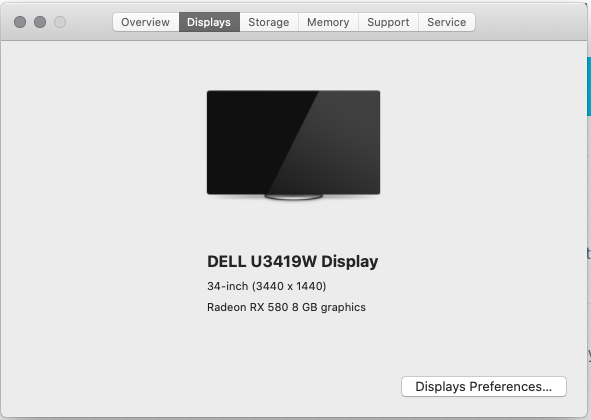
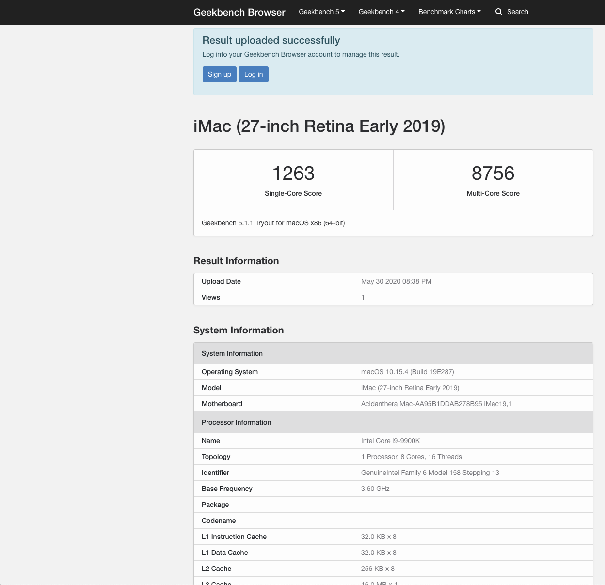
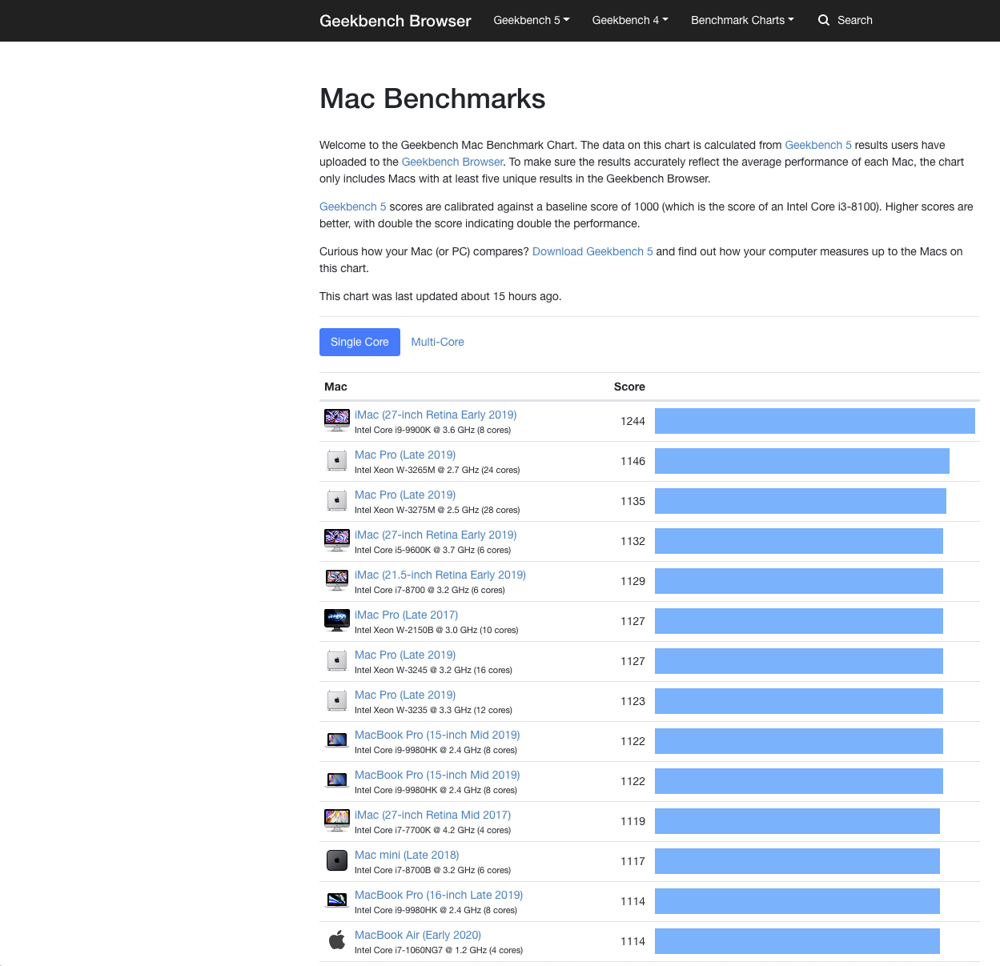
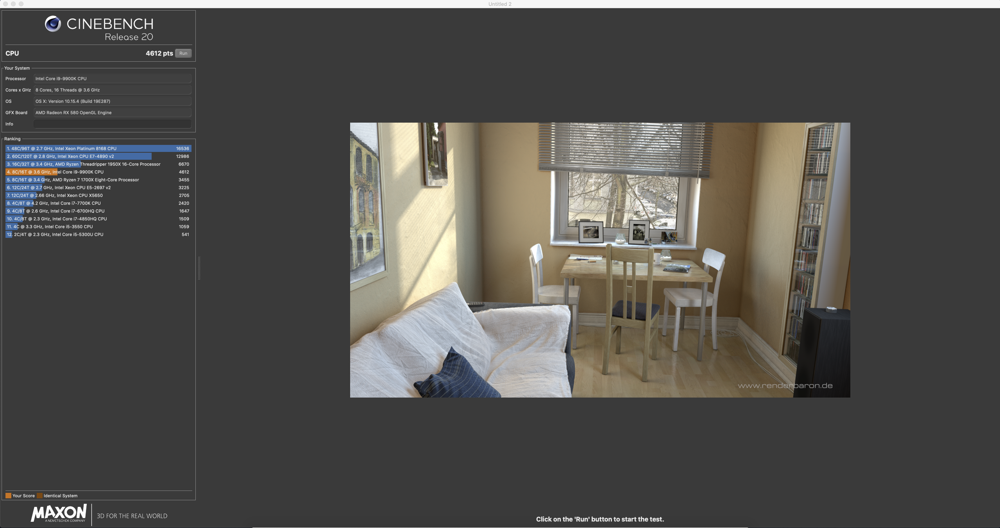

# Hackintosh Installation Guide for Catalina on a Asus ROG Z390-I System

In the last view years I read a lot about "Hackintosh" setup and usages. I also talked a lot with people about their experiences made with Hackintosh systems. Now that I am working mainly in my home office I thought it was the right time to give it a try.

At this point in time I am working successfully with the hackintosh system at home. My main usage of the system is communication, office work and programming with Java and Container technologies.
Afterwards you will get some insights about my configuration, references and my experiences.

In general there exists two possibilites to configure and run a Hackintosh system:
- [Clover EFI Bootloader](https://sourceforge.net/p/cloverefiboot/wiki/Home/)
- [OpenCore Desktop Guide](https://dortania.github.io/OpenCore-Desktop-Guide/)

After evaluation both possibilites (see [hackintosh-forum.de](https://www.hackintosh-forum.de/forum/thread/45928-neuanfangen-mit-clover-oder-opencore/)) I decided to go with OpenCore (0.5.8).

## Hardware
<details>
<summary>Details</summary>

Type  | Item
--|--
CPU  |  Intel Core i9-9900K 3.6 Ghz 8-Core Processor
CPU Cooler  | Corsair Hydro H60 (Water-Cooling)
Motherboard | Mainboard S1151 Asus ROG Strix Z390-I
Memory | 64GB Corsair Vengeance LPX (2x32 GB)
Video Card | Sapphire - Radeon RX 580 Pulse 8192MB
Case | ITX Fractal Design Node 304 (white)
Power Supply | 550W Seasonic FOCUS GX-550 FM
Hard Disk | SSD 1TB Samsung 860 Evo SATA
Monitor | DELL U2713H with Mini DisplayPort
daskeyboard  | A mechanical keyboard for Mac power-users

</details>

## What works now
<details>
<summary>Details</summary>

- Local Ethernet
- Bluetooth and Wireless dosn't work (but have a look on [this](https://github.com/AppleIntelWifi/adapter))
- GraphCard works
- Sleep / Wake
- Power Nap (sleep with background operations such as Time Machine)
- iMessage
- Pages, Numbers, Keynote
- iCloud
- iPhoto
- iMovie
- Virtualization with Oracle VirtualBox and Docker
- Webcam with iPhone 7 and EpocCam HD app

### Wifi with Intel Chipset

I played a little bit with [AppleIntelWifi kext](https://github.com/AppleIntelWifi/adapter). However I didn't get it to work in a stable way. However I recommend to have a look on this from time to time.

The usage is very well explained in this [video](https://www.youtube.com/watch?reload=9&v=7NwXl-r4vlQ&feature=youtu.be).

```
sudo chown -R root:wheel *.kext
sudo chmod -R 755 *.kext
sudo kextload -v *.kext
```

</details>

## Experiences I made
<details>
<summary>Details</summary>

- Reserve time to gather the knowledge to build a hackintosh (Bootloader, structure, evaluation, etc.)
- Lookup for other experiences made by people using the same motherboard. I found a lot of videos and other sources for my configuration.
- I build the hackintosh based on the guide provided by [tonymacx86.com](https://www.tonymacx86.com/)
- Use a high speed USB stick. I started with a very slow one and that was hurrable, when booting the machine from it.
- UniBeast works only with sticks up to 64GB (Workaround was to partition the stick)
- My first try was to use UniBeast 10.1.0 for Catalina. However with this setting I am wasn't able to start the installer of macOS. It always stucks when the apple logo was displayed when booting the system from the stick. In verbose mode I saw that it hangs after PCI configuration ends. All workarounds found on google doesn't solve the problem. Then I used a pre-defined EFI configuration from [tonymacx86.com](https://www.tonymacx86.com/threads/the-everything-works-asus-z390-i-gaming-i7-8700k-sapphire-nitro-radeon-rx-vega-64-build.272572/#Trouble%20Shooting). With this EFIT configuration I was successful in installing MacOS.
- Afterwards I finally decided to move to OpenCore as Bootloader.
- For my mainboard I found many examples with different settings. I have to play a little bit to find my needed settings.

</details>

## My Workstation
<details>
<summary>Details</summary>

TODO: Add pictures

</details>

## macOS System Information
<details>
<summary>Details</summary>





</details>

## Benchmark
<details>
<summary>Details</summary>



Afterwards you find a list with single core values: my current value = 1263



Afterwards you find  list with multi-cores values: my current value = 8756




</details>

## Installation Steps

<details>
<summary>Details</summary>

1. Building the USB Installer as described in [OpenCore Desktop Guide](https://dortania.github.io/OpenCore-Desktop-Guide/installer-guide/mac-install.html).

2. Mount the EFI partition on the stick using MountEFI.

3. Adding the base OpenCore files as described in [OpenCore Desktop Guide](https://dortania.github.io/OpenCore-Desktop-Guide/installer-guide/opencore-efi.html)

4. Gathering Drivers and Kexts files needed for your configuration. Read first the section from [OpenCore Desktop Guide](https://dortania.github.io/OpenCore-Desktop-Guide/ktext.html)

    

5. Prepare ACPI configuration for your processor architecutre. In my case a Coffee Lake (see [OpenCore Desktop Guide](https://dortania.github.io/OpenCore-Desktop-Guide/config.plist/coffee-lake.html))

6. Start with SSDT-Plug and [follow this link to the github repo behind this link](https://github.com/acidanthera/OpenCorePkg/blob/master/Docs/AcpiSamples/SSDT-PLUG.dsl). Then click on button Raw and copy the complete text from the page into the clipboard

    

   6.1 Start the application MaciASL and choose **File > New** from the menu

   6.2 Copy the text from the clipboard into the new window

    

   6.3 Save the file as `SSDT-PLUG`within Desktop and use File Formt `ACPI Machine Language Binary`.

    

   **Note:** Do this for every required SSDTs mention on [OpenCore Desktop Guide](https://dortania.github.io/OpenCore-Desktop-Guide/config.plist/coffee-lake.html)

7. Copy all generated files into the folder OC/ACPI

   

8. Open the file OC/config.plist with the application ProperTree

9. Remove the first Warning lines (in my case 4 lines)

10. Then use the command `OC Snapshot` from the File menu to inject all previously copied files. Take care to enable afterwards.

11. Follow the [OpenCore Desktop Guide](https://dortania.github.io/OpenCore-Desktop-Guide/config.plist/coffee-lake.html)guide for Coffee Lake and make changes as needed

12. Optinal: Update BIOS-Version. Lookup latest version at [Asus Homepage](https://www.asus.com/de/Motherboards/ROG-STRIX-Z390-I-GAMING/HelpDesk_BIOS/)

13. Modify BIOS-Setting inspired by:

- [github](https://github.com/czombos/asus-rog-strix-z390-i-gaming-hackintosh)
- [OpenCore guide fro Coffee Lake](https://dortania.github.io/OpenCore-Desktop-Guide/config.plist/coffee-lake.html#intel-bios-settings)
- [Youtube video](https://www.youtube.com/watch?v=hlV4FC-5Uu8)
- **Important:** Also Clear Secure Boot Keys in the Boot menu

14. Afterwards follow the [Installation Process in the OpenCore Desktop Guide](https://dortania.github.io/OpenCore-Desktop-Guide/installation/installation-process.html) to install macOS Catalina.

15. Checked and improved Audio, following [Post-Install Step: Fixing Audio](https://dortania.github.io/OpenCore-Desktop-Guide/post-install/audio.html)

16. Prepared the usage of iServices following the steps [Post-Install Step: Fixing iServices](https://dortania.github.io/OpenCore-Desktop-Guide/post-install/iservices.html)

17. Install RTCMemoryFix because BIOS already stops the restart. Followed the solution provided in [OpenCore General Troubleshooting Guide](https://dortania.github.io/OpenCore-Desktop-Guide/troubleshooting/troubleshooting.html#bios-reset-or-sent-into-safemode-after-rebootshutdown)

</details>

## Tools
<details>
<summary>Details</summary>

Tools and commands needed to setup and configure a Hackintosh:

### Mount EFIT partition manually

```bash
diskutil list
sudo mkdir /Volumes/EFI
sudo mount -t msdos /dev/disk0s1 /Volumes/EFI
```

- [MountEFI](https://github.com/corpnewt/MountEFI): Easy mount of EFI partition.
- [MaciASL](https://bitbucket.org/RehabMan/os-x-maciasl-patchmatic/downloads/): ACPI Machine Language IDE for OS X. A native AML compiler and IDE for OS X.
- [ProperTree](https://github.com/corpnewt/ProperTree): For editing our config, this editor has some super useful tools for OpenCore
- [GenSMBIOS](https://github.com/corpnewt/GenSMBIOS): For generating our SMBIOS

</details>

## References
<details>
<summary>Details</summary>

- [tonymacx86: resources and help to build an hackintosh](https://www.tonymacx86.com/:)
- [OpenCore Desktop Guide](https://dortania.github.io/OpenCore-Desktop-Guide/)
- [Hackintosh Vanilla Desktop Guide](https://hackintosh.gitbook.io/-r-hackintosh-vanilla-desktop-guide/)
- [asus-rog-strix-z390-i-gaming-hackintosh](https://github.com/czombos/asus-rog-strix-z390-i-gaming-hackintosh): github project to build a hackintosh with the same configuration
- [ASUS Z390 E GAMING with Intel i9-9900K Opencore 0.5.7 Hackintosh & Benchmarks!](https://www.youtube.com/watch?v=hlV4FC-5Uu8): Youtube video with details about setup the hackintosh with the asus mainboard
- [Setup hackintosh with the same configuration using Clover](https://www.tonymacx86.com/threads/the-everything-works-asus-z390-i-gaming-i7-8700k-sapphire-nitro-radeon-rx-vega-64-build.272572/#Trouble%20Shooting)
- [CustoMac Mini Deluxe im Eigenbau Teil 1 Hardware Überblick (Hackintosh) Tutorial Deutsch | iDomiX](https://www.youtube.com/watch?v=mNbCKRTRtss)
</details>
