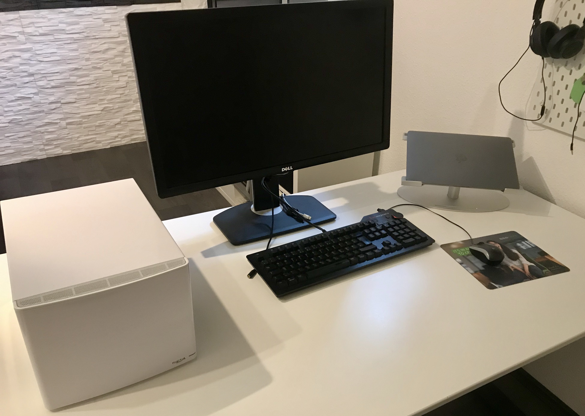
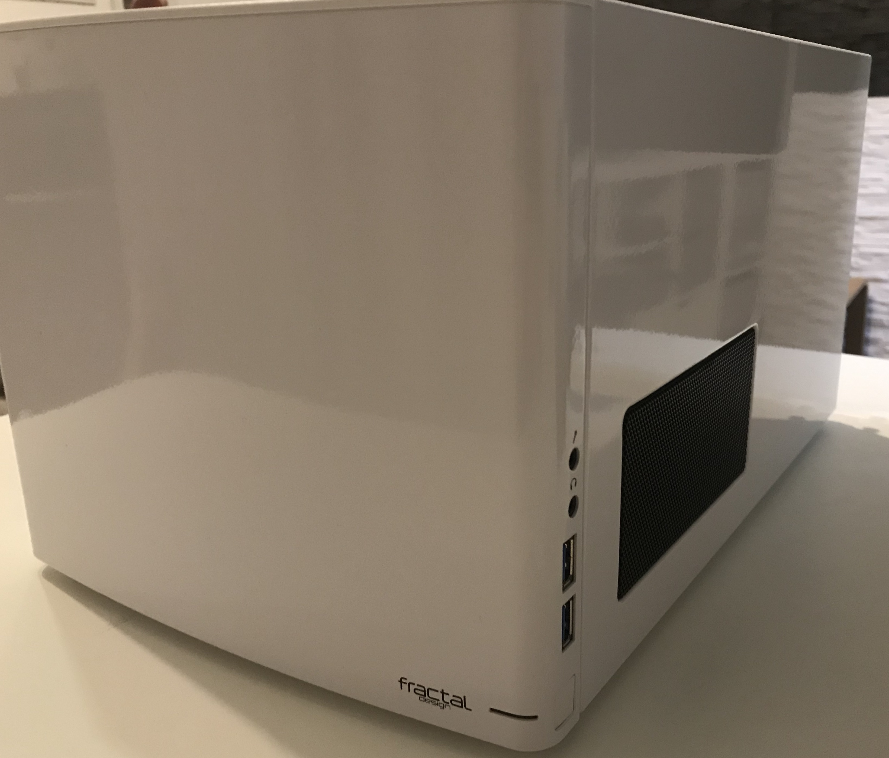
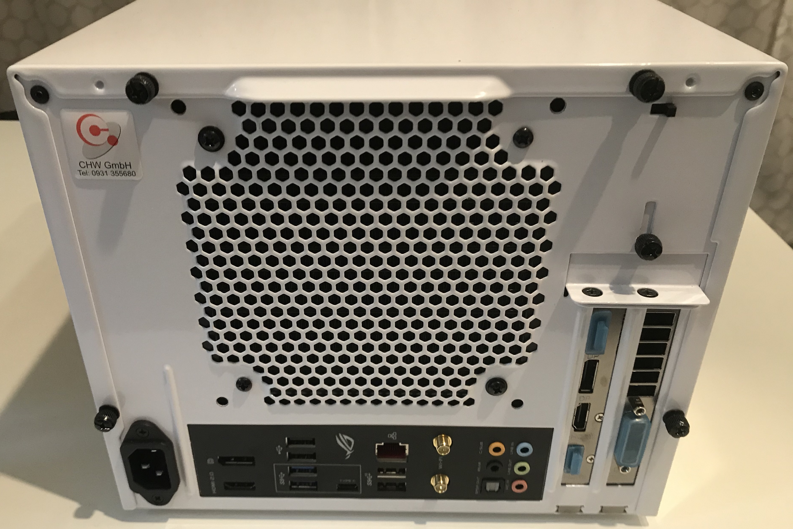
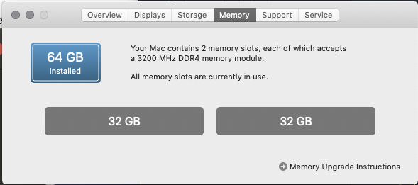

# Hackintosh Installation Guide for Catalina on a Asus ROG Z390-I System

In the last view years I read a lot about "Hackintosh" setup and usages. I also talked a lot with people about their experiences made with Hackintosh systems. Now that I am working mainly in my home office I thought it was the right time to give it a try.

At this point in time I am working successfully with the hackintosh system at home. My main usage of the system is communication, office work and programming with Java and Container technologies.
Afterwards you will get some insights about my configuration, references and my experiences.

I used this guides as starting point:

- https://dortania.github.io/OpenCore-Install-Guide
- https://dortania.github.io/OpenCore-Post-Install
- https://openintelwireless.github.io

Current Versions:

- Current macOS version: macOS Sonoma 14.0
- Current OpenCore version: 0.9.6
- Current BIOS version: 2812. 

## Upgrades

Details

- [Description of the upgrade from OpenCore 0.7.9 and macOS Monterey](./docs/upgrade-to-macos-monterey.md)

- For the upgrade to OpenCore 0.9.5 and macOS Sonoma I do exactly the same steps as described in the upgrade to OpenCore 0.7.9 and macOS Monterey. No special other step was required.

## Hardware

Details

Type  | Item
--|--
CPU  | Intel Core i9-9900K 3.6 Ghz 8-Core Processor (Coffee Lake) 
CPU Cooler  | Corsair Hydro H60 (Water-Cooling)
Motherboard | Mainboard S1151 Asus ROG Strix Z390-I
Memory | 64GB Corsair Vengeance LPX (2x32 GB)
Video Card | Sapphire - Radeon RX 580 Pulse 8192MB
Case | ITX Fractal Design Node 304 (white)
Power Supply | 550W Seasonic FOCUS GX-550 FM
Hard Disk | SSD 1TB Samsung 860 Evo SATA
Monitor | DELL U3419W with Mini DisplayPort (updated to this big monitor) 
daskeyboard  | A mechanical keyboard for Mac power-users

## What works now

Details

- Local Ethernet
- Bluetooth
- Wireless
- GraphCard works
- Sleep / Wake
- Power Nap (sleep with background operations such as Time Machine)
- iMessage
- Pages, Numbers, Keynote
- iCloud
- iPhoto
- iMovie
- Virtualization with Oracle VirtualBox and Docker
- Webcam with iPhone 11 and EpocCam HD app
- Webcam external via USB

## Experiences I made

Details

- Upgrade to OpenCore 0.7.9 was easy when using the tools OpenCore Configurator and OC_Gen-X (see section tools below).
- With using OpenIntelWireless I am also able to use the internal Wireless and Bluetooth capabilities.
- I would recommend to use this tools instead of do the manual way.
- First try your new configuration on a USB stick before finally moving the configuration to the EFIT "final" partition.

## My Workstation

Details

For some month I upgraded to a new curved monitor 34-inches model from DELL. It is really a joy to work with such a big monitor.

## macOS System Information

Details

## Benchmark

Details

Afterwards you find a list with single core values: my current value = 1263

Afterwards you find  list with multi-cores values: my current value = 8756

## Tools

Details

Tools and commands needed to setup and configure a Hackintosh:

- [Opencore Configurator](https://mackie100projects.altervista.org/download-opencore-configurator/): A graphical ui to manage the content of config.plist.
- [Hackintool](https://github.com/headkaze/Hackintool/releases)
- [Opencore Gen-X](https://github.com/Pavo-IM/OC-Gen-X/releases): A graphical ui to create a new config.plist based on system type.
- [MountEFI](https://github.com/corpnewt/MountEFI): Easy mount of EFI partition.
- [ProperTree](https://github.com/corpnewt/ProperTree): For editing our config, this editor has some super useful tools for OpenCore
- [GenSMBIOS](https://github.com/corpnewt/GenSMBIOS): For generating our SMBIOS

## References

Details

- [IntelBluetoothFirmware](https://github.com/OpenIntelWireless/IntelBluetoothFirmware)
    IntelBluetoothFirmware is a Kernel Extension that uploads Intel Wireless Bluetooth Firmware to provide native Bluetooth in macOS

- [tonymacx86: resources and help to build an hackintosh](https://www.tonymacx86.com/:)

- [OpenCore Desktop Guide](https://dortania.github.io/OpenCore-Desktop-Guide/)

- [asus-rog-strix-z390-i-gaming-hackintosh](https://github.com/czombos/asus-rog-strix-z390-i-gaming-hackintosh): github project to build a hackintosh with the same configuration

- [ASUS Z390 E GAMING with Intel i9-9900K Opencore 0.5.7 Hackintosh & Benchmarks!](https://www.youtube.com/watch?v=hlV4FC-5Uu8): Youtube video with details about setup the hackintosh with the asus mainboard

- [ROG STRIX Z390-I Gaming Firmware Updates](https://rog.asus.com/motherboards/rog-strix/rog-strix-z390-i-gaming-model/helpdesk_bios)

  

