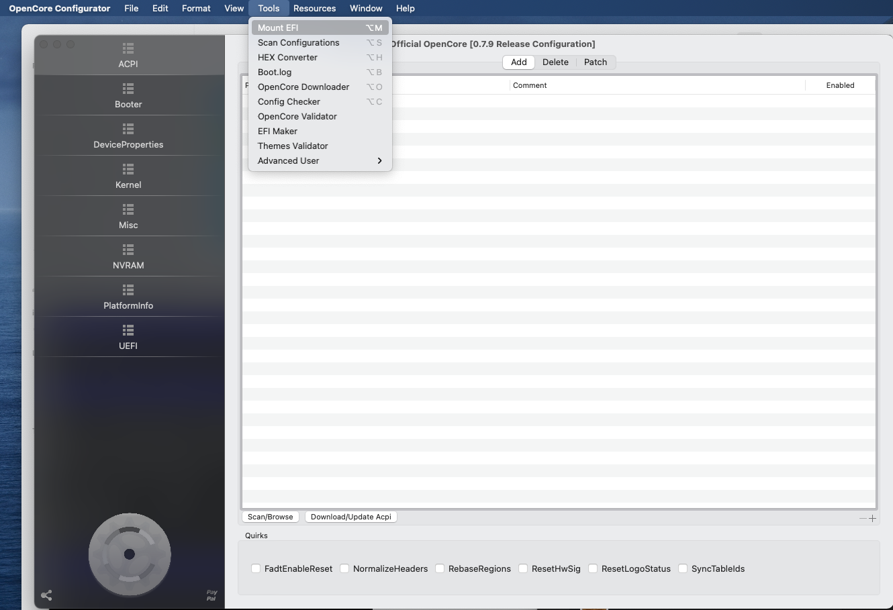
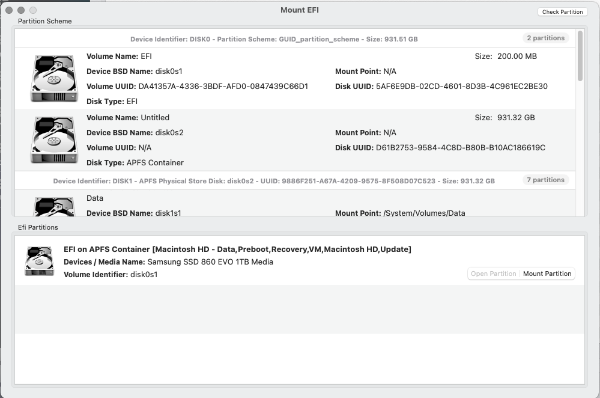
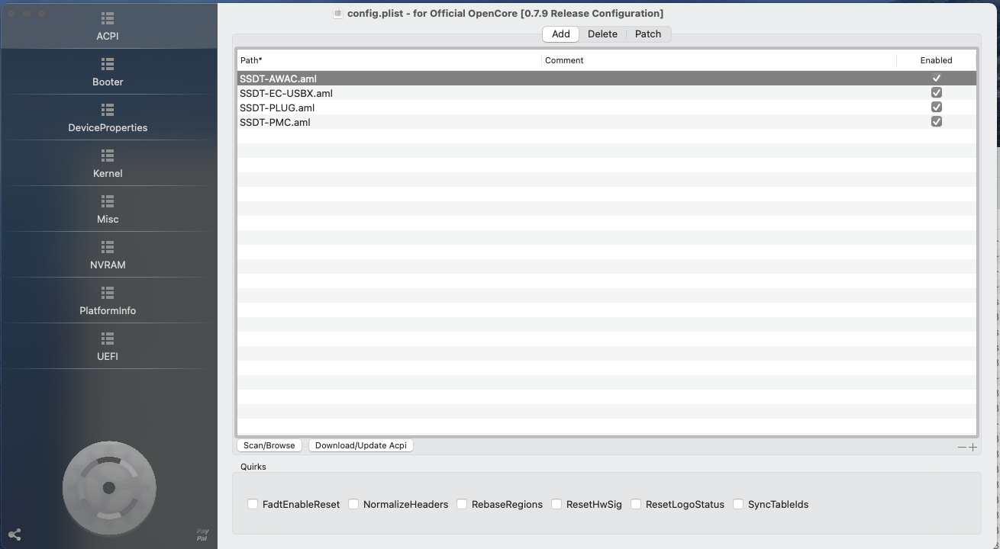
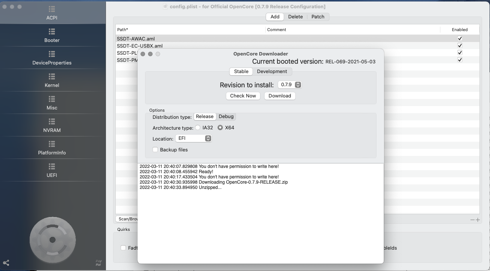
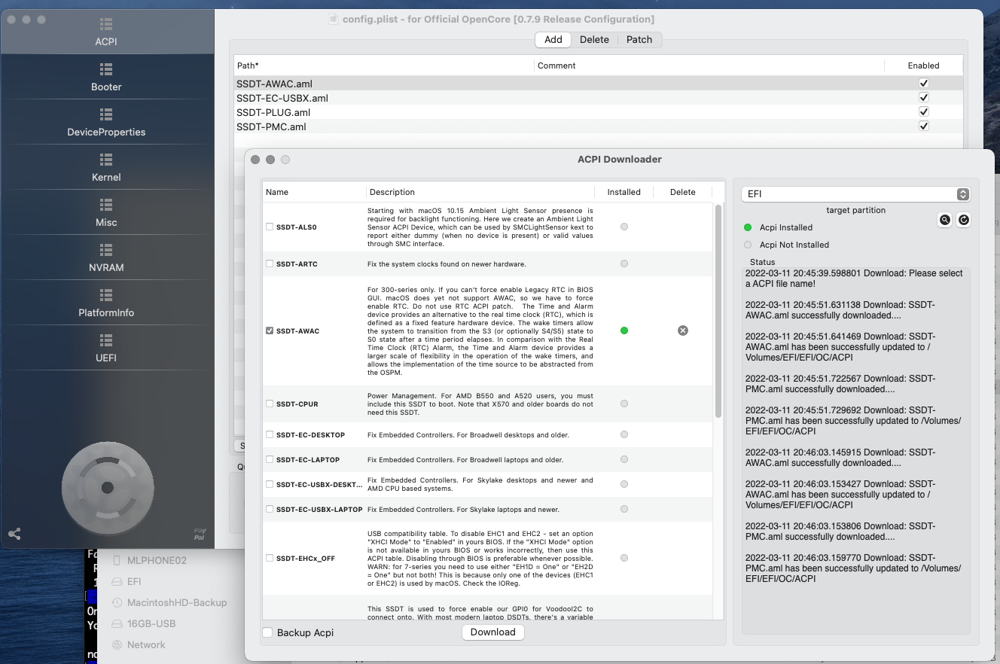
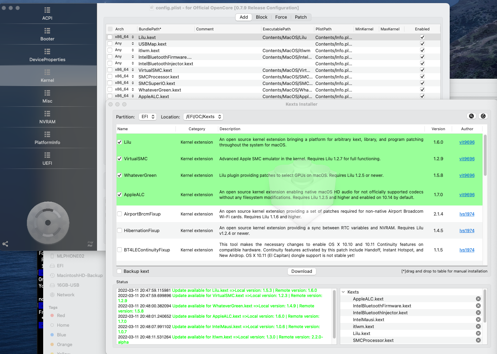
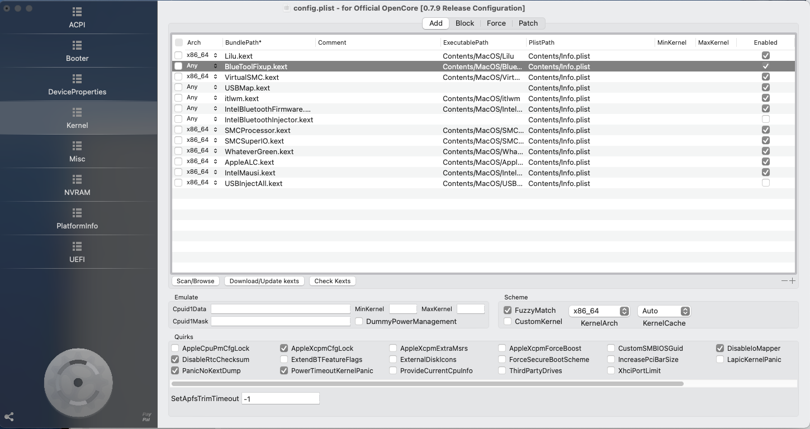
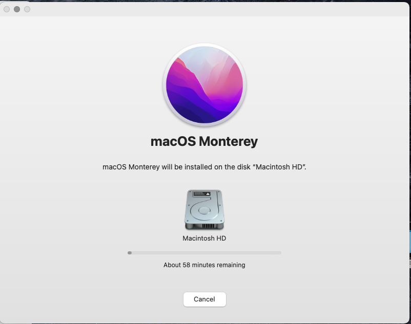

# Upgrade to macOS Monterey

## Upgrade OpenCore from 0.6.9 to 0.7.9

1. Create a backup of the existing EFIT Partition

    Use the OpenCore Configurator to mount EFIT partition

    

    

    Copy the content of the EFI-Partition to another backup medium.

2. Upgrade OpenCore configuration (plist.config)

    - Mount an USB drive with an already prepared EFI-partition (use OpenCore Configurator for this action)

    - Copy the previously backuped EFI configuration to the EFI-partition on the mounted USB stick

    - Open the file EFI/OC/config.plist in OpenCore Configurator

      

    - Go to Tools > OpenCore Downloader 

      Select the EFI partition from the dropdown list "Location"

      

- Update ACPI

    Click on Button <Download/Update Acpi>

    

- Update Kernel

    Click on Button <Download/Update kexts>

    

- Update IntelBluetoothFirmware

    Download latest release from [IntelBluetoothFirmeware](https://github.com/OpenIntelWireless/IntelBluetoothFirmware/releases/download/v2.1.0/IntelBluetoothFirmware-v2.1.0.zip)

    Copy the files IntelBluetoothFirmware.kext and IntelBluetoothInjector.kext to EFI/OC/Kexts

    Deactivate IntelBluetoothInjector.kext in Kernel settings

    Download [BrcmPatchRAM] (https://github.com/acidanthera/BrcmPatchRAM/releases) and copy the file BlueToolFixup.kext to EFI/OC/Kexts

    

- Check the configuration using mentu Tools > Confic Checker

     

- Test system startup with the USB drive. When everything is working copy the EFI-partition from the USB drive to the hard drive of your
computer. Afterwards restart your computer.

## Upgrade MacOS

After upgrading MacOS restart your computer und everything should work as expected.

## Tools

- [OpenCore Configurator GUI](https://mackie100projects.altervista.org/)

## References

- [Updating OpenCore, kexts and macOS](https://dortania.github.io/OpenCore-Post-Install/universal/update.html#updating-opencore)

